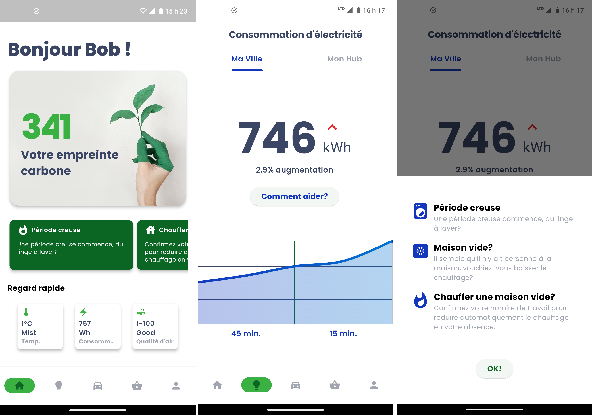
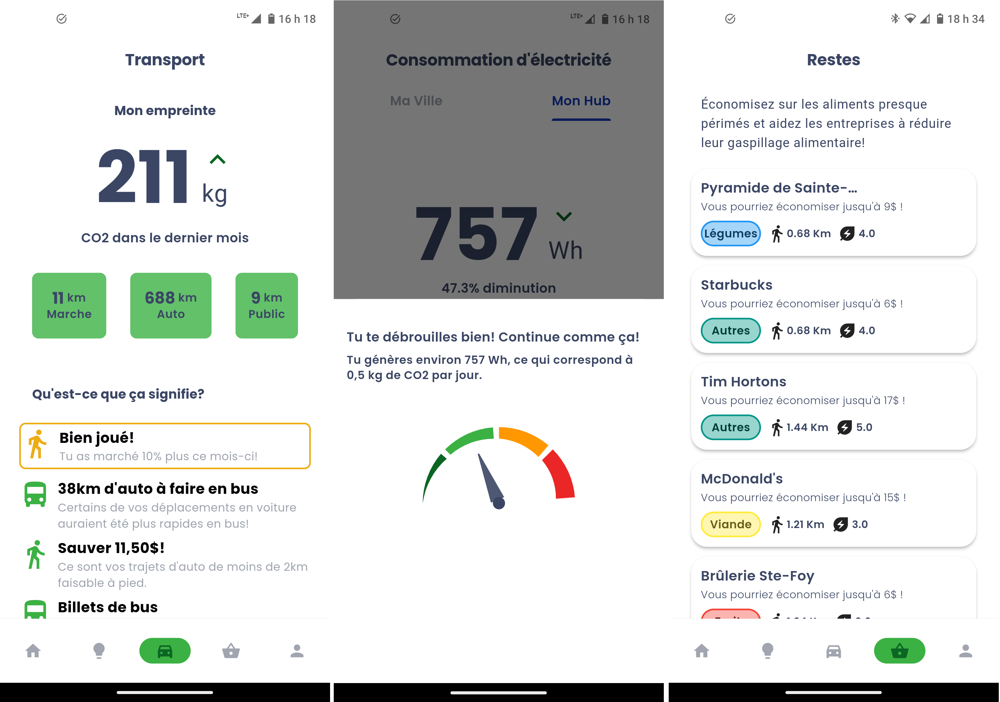

# AMC_2024

## Context

This is a copy of my team's repository for the AMC mobile apps hackathon, which we won in January 2024. This competition is organized by a club from ETS, in Montreal.

We had 24 hours to create a mobile app based on the theme "_Smart cities for a sustainable future_".

We envisioned a virtual assistant that analyzes your environmental impact in every aspect of your life: residence, transportation, and food. It suggests personalized actions that allow you to protect the environment while saving time or money, as these are the primary motivators for people. Our application pulls data from several APIs (Hydro-Québec, CarbonInterface, Google Places API, etc.) and displays real-time data.

### Contributors

- [Christophe Duchesne](https://github.com/cduchesne1)
- [Jonathan Bessette](https://github.com/JoBess7)
- [David Ferland](https://github.com/Davidferl)
- [BaboucheOne](https://github.com/BaboucheOne)

### Screenshots

## Getting Started 🚀

First you need to make sure your flutter is up to date with `flutter upgrade`

Then download all dependencies by running `flutter pub get`

You can then run the app with `flutter run`

## App Icon ©

We may need to change the app icon during the challenge. To help us deal with all the different formats for IOS and android, we added the [flutter_launcher_icons](https://pub.dev/packages/flutter_launcher_icons) package.

Here is the procedure to update the app Icon:

1) Generate the new icon on the [easyappicon](https://easyappicon.com/) website. You must select `ios + adaptive icon` when downloading the icon.

2) Change the images in the `assets/launcher` folder. For Android, use the images from the `mipmap-xxxhdpi` folder and for IOS use the `iTunesArtwork@2x.png` file. If you need to change the background color, generate a png of the same size as the foreground.

3) Run the command `flutter pub run flutter_launcher_icons`

## Translation

To add translation text, modify the files in the `lib/l10n` folder. When modifying those files, run the `flutter gen-l10n` command.

